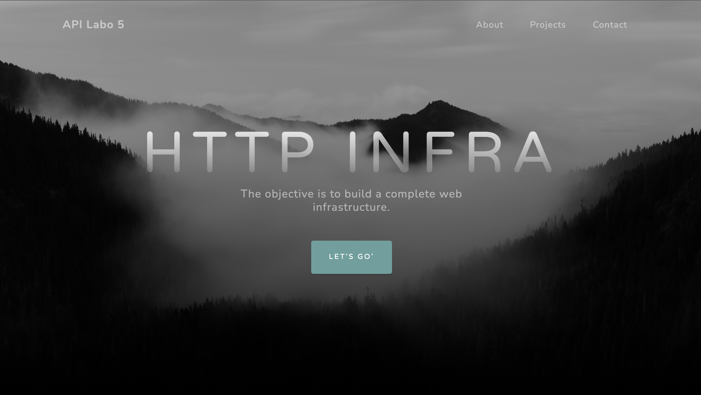
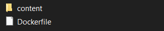
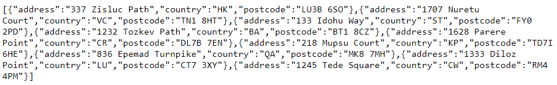

# API-2021-HTTP-Infra-Sandoz-Picot

## Step 1: Static HTTP server with apache httpd

Pour la première étape nous allons configuré un serveur statique apache. Nous utilisons une image docker pour le server, l'image php trouvé sur docker hub [php](https://hub.docker.com/_/php "lien à docker hub") .

Pour lancer le serveur il faut commencer par créer l'image docker. Il faut exécuter la commande suivant dans le dossier *docker-images/apache-php-image*.

La branche git correspondante est *fb-apache-static*.

`docker build -t api/apache_php .`

Puis lancer l'application à l'aide de la commande suivante.

`docker run -p 8080:80 api/apache_php`

Si dans un navigateur vous vous connecter à http://localhost:8080/ ,vous serez accueilli par cette page:



### Configuration

Dans le dossier docker-images/apache-php-image, il y a deux éléments


le dossier content contient tous les éléments pour l'affichage du serveur. Le modèle du serveur est disponible [içi](https://startbootstrap.com/theme/grayscale)

le fichier Dockerfile permet de générer une image docker. Son contenu est assez court, juste deux lignes.
`FROM php:7.2-apache` qui permet de préciser quelle version de apache nous utilisons.
`COPY content/ /var/www/html/` qui permet de copier les composants du site dans /var/html/html/ qui est le chemin que le serveur va utilisé pour afficher le site.


## Step 2: Dynamic HTTP server with express.js

Nous allons ensuite lancer un serveur dynamique qui retournera du contenu JSON, celui-ci sera une liste d'adresse.

La branche git correspondante est *fb-express-dynamic*.

Depuis le dossier courant *docker-images/express-image*, exécuter dans une console de commande :

`docker build -t api/express .`

Puis lancer l'application à l'aide de la commande suivante.

`docker run -p 9090:3000 api/express`

Il est important de noter que ce container docker est de base à l'écoute sur le port 3000.

En vous connectant à http://localhost:9090/ vous verrez afficher une liste d'adresse, celle-ci est généré aléatoirement à chaque fois qu'on se connecte au serveur.
Voici un exemple d'affichage. La liste est au format json.


### index.js

Le fichier utilise chance.js pour générer aléatoirement les informations des adresses. Et utilise express.js pour communiquer les informations.
```
var Chance = require('chance');
var chance = new Chance();

var express = require('express');
var app = express();
```
L'application écoute sur le port 3000 au moyen de .listen
```
app.listen(3000, function(){
	console.log('Accepting HTTP requests on port 3000.');
});
```
L'application appelera la fonction generateAddresses si aucune autre information lui est donné dans l'url, par exemple si on tape `localhost:9090/test`
```
app.get('/test', function(req, res){
	res.send('Hello API - test is working');
});

app.get('/', function(req, res){
	res.send(generateLocations());
});
```
La fonction appelé génére entre 3 et 15 adresse qu'elle met dans un tableau
```
function generateLocations(){

    var numberOfLocations = chance.integer({
        min: 0,
        max: 20
    });

    console.log(numberOfLocations);

    var locations = [];
    for(var i = 0; i < numberOfLocations; i++){
		var address = chance.address();
		var country = chance.country();
		var postcode = chance.postcode();

        locations.push({
            address: address,
			country: country,
            postcode: postcode,
        });
    };
    console.log(locations);

    return locations;
}
```

### Dockerfile

```
FROM node:17.3.0

RUN apt-get update && apt-get install -y vim

COPY src /opt/app

CMD ["node", "/opt/app/index.js"]
```
La première ligne indique la version de node.js a installé.
La deuxième ligne installe vim pour
La troisième copie le dossier src dans le dossier du container qui sert de serveur.
La dernière ligne permet d'exécuter une commande à chaque démarage dans un conteneur, cette commande démarre le script index.js


## Step 3: Reverse proxy with apache (static configuration)

Pour la troisième partie il faut au préalable avoir exécuté les parties 1 et 2. Cette partie consistera à créer un serveur qui redirigera sur le serveur apache statique ou le serveur node dynamique selon l'adress saisie.
Le serveur qui est un containeur devra choisir sur lequel des deux autres containeurs précèdants rediriger.


La branche git correspondante est *fb-apache-reverse-proxy*.

Depuis le dossier courant *docker-images/apache-reverse-proxy*, exécuter dans une console de commande :

`docker build -t api/apache_rp .`

Puis lancer lancer les trois containers à l'aide des commandes suivante :

`docker run -d --name apache_static api/apache_php`

`docker run -d --name express_dynamic api/express`

`docker run -d --name apache_rp -p 8080:80 api/apache_rp`

