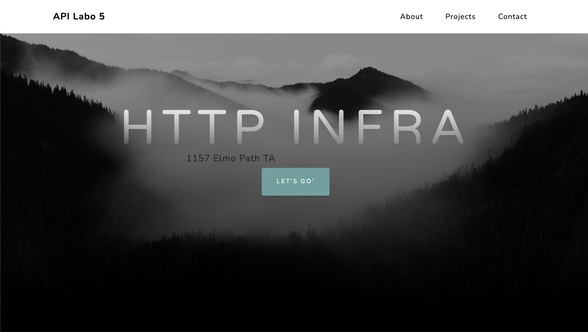

# API-2021-HTTP-Infra-Sandoz-Picot

## Step 1: Static HTTP server with apache httpd

Pour la première étape nous allons configuré un serveur statique apache. Nous utilisons une image docker pour le server, l'image php trouvé sur docker hub [php](https://hub.docker.com/_/php "lien à docker hub") .

Pour lancer le serveur il faut commencer par créer l'image docker. Il faut exécuter la commande suivant dans le dossier *docker-images/apache-php-image*.

La branche git correspondante est *fb-apache-static*.

`docker build -t api/apache_php .`

Puis lancer l'application à l'aide de la commande suivante.

`docker run -p 8080:80 api/apache_php`

Si dans un navigateur vous vous connecter à http://localhost:8080/ ,vous serez accueilli par cette page:


### Configuration

Dans le dossier docker-images/apache-php-image, il y a deux éléments


le dossier content contient tous les éléments pour l'affichage du serveur. Le modèle du serveur est disponible [içi](https://startbootstrap.com/theme/grayscale)

le fichier Dockerfile permet de générer une image docker. Son contenu est assez court, juste deux lignes.
`FROM php:7.2-apache` qui permet de préciser quelle version de apache nous utilisons.
`COPY content/ /var/www/html/` qui permet de copier les composants du site dans /var/html/html/ qui est le chemin que le serveur va utilisé pour afficher le site.


## Step 2: Dynamic HTTP server with express.js

Nous allons ensuite lancer un serveur dynamique qui retournera du contenu JSON, celui-ci sera une liste d'adresse.

La branche git correspondante est *fb-express-dynamic*.

Depuis le dossier courant *docker-images/express-image*, exécuter dans une console de commande :

`docker build -t api/express .`

Puis lancer l'application à l'aide de la commande suivante.

`docker run -p 9090:3000 api/express`

Il est important de noter que ce container docker est de base à l'écoute sur le port 3000.

En vous connectant à http://localhost:9090/ vous verrez afficher une liste d'adresse, celle-ci est généré aléatoirement à chaque fois qu'on se connecte au serveur.
Voici un exemple d'affichage. La liste est au format json.


### index.js

Le fichier utilise chance.js pour générer aléatoirement les informations des adresses. Et utilise express.js pour communiquer les informations.
```
var Chance = require('chance');
var chance = new Chance();

var express = require('express');
var app = express();
```
L'application écoute sur le port 3000 au moyen de .listen
```
app.listen(3000, function(){
	console.log('Accepting HTTP requests on port 3000.');
});
```
L'application appelera la fonction generateAddresses si aucune autre information lui est donné dans l'url, par exemple si on tape `localhost:9090/test`
```
app.get('/test', function(req, res){
	res.send('Hello API - test is working');
});

app.get('/', function(req, res){
	res.send(generateLocations());
});
```
La fonction appelé génére entre 3 et 15 adresse qu'elle met dans un tableau
```
function generateLocations(){

    var numberOfLocations = chance.integer({
        min: 0,
        max: 20
    });

    console.log(numberOfLocations);

    var locations = [];
    for(var i = 0; i < numberOfLocations; i++){
		var address = chance.address();
		var country = chance.country();
		var postcode = chance.postcode();

        locations.push({
            address: address,
			country: country,
            postcode: postcode,
        });
    };
    console.log(locations);

    return locations;
}
```

### Dockerfile

```
FROM node:17.3.0

RUN apt-get update && apt-get install -y vim

COPY src /opt/app

CMD ["node", "/opt/app/index.js"]
```
La première ligne indique la version de node.js a installé.
La deuxième ligne installe vim pour
La troisième copie le dossier src dans le dossier du container qui sert de serveur.
La dernière ligne permet d'exécuter une commande à chaque démarage dans un conteneur, cette commande démarre le script index.js


## Step 3: Reverse proxy with apache (static configuration)

Pour la troisième partie il faut au préalable avoir exécuté les parties 1 et 2. Cette partie consistera à créer un serveur qui redirigera sur le serveur apache statique ou le serveur node dynamique selon l'adress saisie.
Le serveur qui est un containeur devra choisir sur lequel des deux autres containeurs précèdants rediriger.


La branche git correspondante est *fb-apache-reverse-proxy*.

Depuis le dossier courant *docker-images/apache-reverse-proxy*, exécuter dans une console de commande :

`docker build -t api/apache_rp .`

Puis lancer les trois containers à l'aide des commandes suivantes :

`docker run -d --name apache_static api/apache_php`

`docker run -d --name express_dynamic api/express`

`docker run -d --name apache_rp -p 8080:80 api/apache_rp`

Si dans un navigateur vous vous connecter à http://demo.api.ch:8080/ ,vous serez accueilli par la même page qu'à l'étape 1.

### Dockerfile

 ```
 FROM php:7.2-apache

 COPY conf/ /etc/apache2

 RUN a2enmod proxy proxy_http
 RUN a2ensite 000-* 001-*
 ```
 La troisième ligne active les modules apache "proxy" et "proxy_http" qui sont nécessaires pour utiliser apache comme reverse proxy.
 La quatrième ligne active le site avec les deux fichiers de configiration 000-* et 001-*.

### conf/sites-available

 Nous avons créée un dossier "conf/sites-available" dans lequel nous avons ajouté deux fichiers de configuration : "000-default.conf" et "001-reverse-proxy.conf".

 Dans le fichier "000-default.conf", nous avons écrit :
 ```
 <VirtualHost *:80>
 </VirtualHost>
 ```

 Dans le fichier "001-reverse-proxy.conf", nous avons écrit :
 ```
 <VirtualHost *:80>
         ServerName demo.api.ch

         #ErrorLog ${APACHE_LOG_DIR}/error.log
         #CustomLog ${APACHE_LOG_DIR}/access.log combined

         ProxyPass "/api/students/" "http://172.17.0.3:3000/"
         ProxyPassReverse "/api/students/" "http://172.17.0.3:3000/" 

         ProxyPass "/" "http://172.17.0.2:80/"
         ProxyPassReverse "/" "http://172.17.0.2:80/"

 </VirtualHost>
 ```
 Ce fichier de configuration permet de rediriger les requêtes en fonction du chemin : '/' ou '/api/students/'.
 ATTENTION :
 Dans ce fichier noous avons noté les addresses ip en "dur". Pour retrouver les adresses correspondant aux containers, il faut effectuer ces commandes :

 `docker inspect apache_static | grep -i ipaddr`

 `docker inspect express_dynamic | grep -i ipaddr`
 
 
## Step 4: Requêtes AJAX avec JQuery

Pour cette partie, nous allons implémenter des requêtes AJAX avec JQuery dans notre site statique (partie 1) pour récupérer du contenu dynamique sur notre serveur express (partie2).

La branche git correspondante est *fb-ajax-jquery*.

Depuis le dossier courant *docker-images/apache-php-image*, exécuter dans une console de commande :

`docker build -t api/apache_php .`
 
Puis relancer les trois containers (comme la partie 3) à l'aide des commandes suivantes :

`docker run -d --name apache_static api/apache_php`

`docker run -d --name express_dynamic api/express`

`docker run -d --name apache_rp -p 8080:80 api/apache_rp`
 
Si dans un navigateur vous vous connecter à http://demo.api.ch:8080/ ,vous serez accueilli par la même page qu'à l'étape 1, cependant sous le gros titre "HTTP INFRA", vous retrouverez une localisation qui s'actualisera toutes les trois secondes. 




### index.html

Nous avons mit à jour le fichier "index.html" que nous avons créée lors de la partie 1 pour notre site internet. 

```
		<!-- jQuery -->
		<script src="https://ajax.googleapis.com/ajax/libs/jquery/3.6.0/jquery.min.js"></script>
			<!-- Custom script to load locations-->
			<script src="js/locations.js"></script>
```

ATTTENTION :
Nous avons modifier le nom de la class dans notre script pour pouvoir facilement le reporter dans le document "locations.js", decrit ci-dessous.

```
        <!-- Masthead-->
        <header class="masthead">
            <div class="container px-4 px-lg-5 d-flex h-100 align-items-center justify-content-center">
                <div class="d-flex justify-content-center">
                    <div class="text-center">
                        <h1 class="mx-auto my-0 text-uppercase">HTTP Infra</h1>
                        <h2 class="myClass">The objective is to build a complete web infrastructure.</h2>
                        <a class="btn btn-primary" href="#about">Let's Go'</a>
                    </div>
                </div>
            </div>
        </header>
```

### locations.js
Nous avons créée un fichier "locations.js" dans le dossier "content/js" dans lequel nous avons implémenter un script afin de récupérer du contenu dynamique sur notre sute.

```
$(function() {
	console.log("Loading locations");

	function loadLocations() {
		$.getJSON( "/api/students/", function(locations) {
			console.log(locations);
			var message = "No location";
			if (locations.length > 0) {
				message = locations[0].address + " "+ locations[0].country;
			}
			$(".myClass").text(message);
		});
	};
	
	loadLocations();
	setInterval(loadLocations, 5000);
});
```


## Step5: Configuration dynamique du reverse proxy

Dans cette partie, nous avons remplacé la configuration statiques du reverse proxy (adresse IP codées en dur) par une configuration dynamique. Les variables d'envirronnement sont à placer en paramètres lors du lancement du container docker.

La branche git correspondante est *fb-dynamic-config*.

Depuis le dossier courant *docker-images/apache-reverse-proxy*, exécuter dans une console de commande :

`docker build -t api/apach_rp .`

Vous pouvez lancer plusieurs containers pour les images "api/apache_php" et "api/express". 
Afin de connaitre les addresses ip des containers, utiliser les cmmandes : 

`docker inspect apache_static | grep -i ipaddr`

`docker inspect express_dynamic | grep -i ipaddr`

Une fois les addresses connues, lancer le container de l'image "apache_rp" avec la commande : 

`docker run -d -e STATIC_APP=[IPADDRESS]:80 -e DYNAMIC_APP=[IPADDRESS]:3000 --name apache_rp -p 8080:80 api/apache_rp`

Si dans un navigateur vous vous connecter à http://demo.api.ch:8080/ ,vous serez accueilli par la même page qu'à l'étape 4.

### Dockerfile

```
FROM php:7.2-apache

RUN apt-get update && apt-get install -y vim

COPY apache2-foreground /usr/local/bin/
COPY templates /var/apache2/templates
COPY conf/ /etc/apache2

RUN a2enmod proxy proxy_http
RUN a2ensite 000-* 001-*
```
Nous avons ajouté la ligne 3 dans le DockerFile.

### apache2-foreground

Nous avons créée un fichier d'exécution "apache2-foreground" au même endroit que le DockerFile avec ce contenu :
```
#bin/bash
set -e

# Add setup for API
echo "Setup for API:"
echo "Static: $STATIC_APP"
echo "Dynamic: $DYNAMIC_APP"
php /var/apache2/templates/config-template.php > /etc/apache2/sites-available/001-reverse-proxy.conf

# Note: we don't just use "apache2ctl" here because it itself is just a shell-script wrapper around apache2 which provides extra functionality like "apache2ctl start" for launching apache2 in the background.
# (also, when run as "apache2ctl <apache args>", it does not use "exec", which leaves an undesirable resident shell process)

: "${APACHE_CONFDIR:=/etc/apache2}"
: "${APACHE_ENVVARS:=$APACHE_CONFDIR/envvars}"
if test -f "$APACHE_ENVVARS"; then
	. "$APACHE_ENVVARS"
fi

# Apache gets grumpy about PID files pre-existing
: "${APACHE_RUN_DIR:=/var/run/apache2}"
: "${APACHE_PID_FILE:=$APACHE_RUN_DIR/apache2.pid}"
rm -f "$APACHE_PID_FILE"

# create missing directories
# (especially APACHE_RUN_DIR, APACHE_LOCK_DIR, and APACHE_LOG_DIR)
for e in "${!APACHE_@}"; do
	if [[ "$e" == *_DIR ]] && [[ "${!e}" == /* ]]; then
		# handle "/var/lock" being a symlink to "/run/lock", but "/run/lock" not existing beforehand, so "/var/lock/something" fails to mkdir
		#   mkdir: cannot create directory '/var/lock': File exists
		dir="${!e}"
		while [ "$dir" != "$(dirname "$dir")" ]; do
			dir="$(dirname "$dir")"
			if [ -d "$dir" ]; then
				break
			fi
			absDir="$(readlink -f "$dir" 2>/dev/null || :)"
			if [ -n "$absDir" ]; then
				mkdir -p "$absDir"
			fi
		done

		mkdir -p "${!e}"
	fi
done

exec apache2 -DFOREGROUND "$@"
```

### config-template.php

Nous avons créée un dossier "templates" dans lequel nous avons ajouté un fichier "confi-template.php" contenant le code suivant : 

```
<?php
    $dynamic_app = getenv('DYNAMIC_APP');
	$static_app = getenv('STATIC_APP');
?>
<VirtualHost *:80>
        ServerName demo.api.ch

        ProxyPass '/api/students/' 'http://<?php print "$dynamic_app"?>/'
        ProxyPassReverse '/api/students/' 'http://<?php print "$dynamic_app"?>/'

        ProxyPass '/' 'http://<?php print "$static_app"?>/'
        ProxyPassReverse '/' 'http://<?php print "$static_app"?>/'
</VirtualHost>
```

## Additonal steps

### Load balancing : multiple server nodes and round-robin vs sticky sessions

La branche git correspondante est *extrastep*.

ATTENTION : Le fichier apache2-foreground doit avoir des fin de ligne LF et non CRLF.
